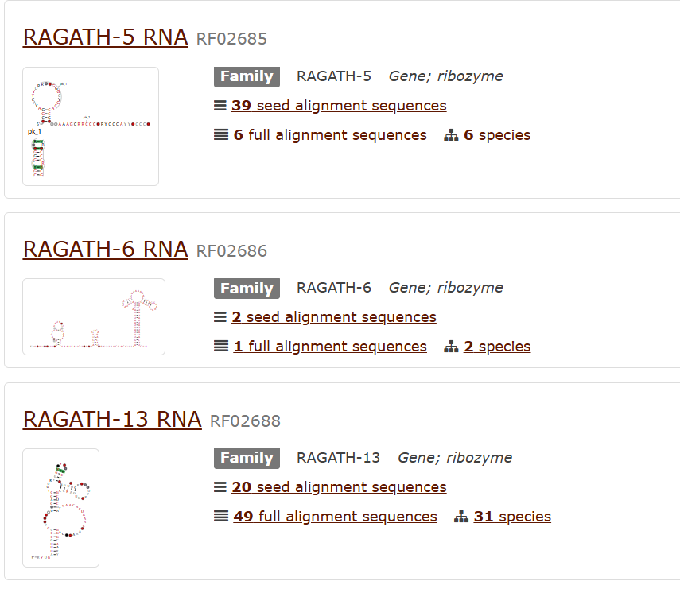

# 核酶

## 已包含的21类

### 小核酶

#### Hammerhead 1986 年，在 RNA 植物病原体（如类病毒和病毒卫星）中发现了第一个锤头核酶。一年后，在蝾螈基因组的卫星 DNA 中也报道了双髻鱼核酶。然后在血吸虫、洞穴蟋蟀、拟南芥和一些哺乳动物（如啮齿动物和鸭嘴兽）等不相关生物的基因组中发现了这种核酶的新例子。2010 年，发现锤头核酶存在于多种细菌和真核生物基因组中，包括人类。类似的报告证实并扩展了这些观察结果，揭示了锤头核酶是所有生命界中无处不在的催化 RNA。

##### 类别

- RF00008 [家庭：家庭Hammerhead_3 （RF00008）](https://rfam.org/family/RF00008) 

  - 类型III Hammerhead Ribozyme

  - 定义与特征：

  - 结构：类型III Hammerhead核酶的二级结构与类型I和类型II有所不同。它们的锤头结构具有更多的空间和结构上的灵活性，可以与不同类型的底物配对。

  - 催化机制：类型III Hammerhead核酶通过与底物的具体配对来进行切割。它们常常被用于特定的RNA序列剪切任务，尤其是在精准的RNA剪切反应中。

  - 应用：适用于更复杂的催化反应和RNA干扰的研究。

  - 例子：常见于细菌和病毒中，作为自催化RNA分子参与其基因表达调控。

- RF00163 [家庭：家庭 （Hammerhead_1 （RF00163）](https://rfam.org/family/RF00163)

  - 类型I Hammerhead Ribozyme

  - 定义与特征：

  - 结构：类型I Hammerhead核酶是最经典的类型。它由一个保守的“锤头”结构组成，这种结构包含三个主要的连结区域：P1、P2、P3。其中，P1区域包含切割反应位点，P2和P3区域则形成必要的二级结构，以保证反应的发生。

  - 催化机制：其催化反应涉及两次转酯反应，最终导致RNA链的切割。这个过程依赖于两个关键的镁离子。

  - 应用：由于其在原核和真核细胞中的广泛分布，类型I Hammerhead核酶在基因编辑、RNA干扰等领域中具有潜在的应用。

  - 例子：来自病毒的Hammerhead核酶，如来自某些病毒的RNA剪切酶。

- RF02275 [Rfam： 家庭： Hammerhead_HH9 （RF02275）](https://rfam.org/family/RF02275)

  - HH9 (Hammerhead Ribozyme HH9)

  - HH9 最初是在某些真核生物和病毒 RNA 中被发现。

  - 定义与特征：

  - 结构：HH9是一个天然存在的锤头核酶变体，通常是通过修饰类型I或类型II核酶的结构域，增强其催化活性。HH9的二级结构经过调节以提高对特定RNA序列的识别能力。

  - 催化机制：其催化机制和类型I Hammerhead核酶相似，但HH9通过其特有的序列和结构增强了切割效率。

  - 应用：HH9核酶被广泛应用于精准的RNA剪切实验、基因沉默研究以及生物分子工程等领域。

  - 例子：在一些基因治疗研究中，HH9作为工具用于提高RNA干扰的效果。

- RF02276 [家庭： 家庭 （Hammerhead_II （RF02276）](https://rfam.org/family/RF02276)

  - 类型II Hammerhead Ribozyme

  - 定义与特征：

  - 结构：类型II Hammerhead核酶的结构相比类型I有所不同。虽然它们也具有类似锤头的二级结构，但在底物识别和催化过程中，P1和P3区域会有显著的结构差异。

  - 催化机制：类似于类型I核酶，类型II Hammerhead核酶通过转酯反应来切割RNA链，但在具体催化反应的机制上有所区别。

  - 应用：主要用于研究其在复杂的生物学系统中的表现，尤其是在分子生物学实验中，作为模型核酶进行功能分析。

  - 例子：类型II核酶可以通过化学修饰来提升催化效率，成为RNA干扰研究中的工具。

- RF02277 [Rfam： 家庭： Hammerhead_HH10 （RF02277）](https://rfam.org/family/RF02277)

  - Hammerhead_HH10 

  - HH10 是在自然界中通过生物信息学分析和实验验证发现的，存在于一些真核生物 RNA 中。

  - 定义与特征：

  - 结构：Hammerhead_HH10是一种经过设计优化的Hammerhead核酶。它通常具有与HH9相似的结构，但在序列和空间构象上进行了改进，进一步增强其催化活性。

  - 催化机制：它的催化反应机制和经典的类型I Hammerhead核酶类似，但在特定条件下表现出更高的效率。

  - 应用：Hammerhead_HH10常用于精确的RNA干扰，能够针对特定的mRNA靶标进行剪切，应用于基因表达调控和癌症治疗等。

  - 例子：

  - HH10通常被设计用于RNA序列的靶向干扰实验。

- RF03152 [Rfam： 科： RAGATH-1-锤头鲨 （RF03152）](https://rfam.org/family/RF03152)

  - RAGATH-1-Hammerhead

  - RAGATH-1 来自 真核基因组 的特定非编码区域。

  - 它可能起源于基因组进化过程中未完全失活的自剪切 RNA 元件。

  - 定义与特征：

  - 结构：RAGATH-1-Hammerhead是一种改造后的Hammerhead核酶，结合了不同类型的核酶特性。这种核酶在设计上结合了传统Hammerhead结构与其他核酸酶的特点，进一步扩展了其应用范围。

  - 催化机制：它的催化机制比标准Hammerhead核酶更具特异性和效率，尤其是在复杂的RNA剪切反应中。

  - 应用：RAGATH-1-Hammerhead常用于基因工程和分子生物学研究中，尤其在特定RNA序列的识别和剪切中发挥重要作用。

  - 例子：作为一个工程化的工具，RAGATH-1-Hammerhead被用于高效的RNA剪切实验和定向基因沉默研究。

##### 比较

### HDV 丁型肝炎病毒 （HDV） 核酶是在丁[型肝炎病毒](https://en.wikipedia.org/wiki/Hepatitis_delta_virus)中发现的一种[非编码 RNA](https://en.wikipedia.org/wiki/Non-coding_RNA)，是病毒复制所必需的。丁型肝炎病毒是已知的唯一一种利用[核酶](https://en.wikipedia.org/wiki/Ribozyme)活性感染宿主的人类病毒。核酶在丁型肝炎病毒复制过程中在自切割反应中将 RNA 转录物加工成单位长度，该病毒被认为通过双[滚动圆](https://en.wikipedia.org/wiki/Rolling_circle)机制传播。核酶在体内没有任何蛋白质因子的情况下具有活性，并且在被发现时是已知最快的天然自裂解 RNA。

- RF00094 [Rfam： 家庭： HDV_ribozyme （RF00094）](https://rfam.org/family/RF00094)

  - 催化功能：

    - HDV 核酶能够高效催化自身 RNA 链的磷酸二酯键断裂，这是病毒 RNA 复制过程中必需的步骤。

    - 其催化效率非常高，与一些蛋白质酶相当。

  - 结构特性：

    - HDV 核酶的活性核心区域由一个 单一的 RNA 分子 构成，形成高度复杂的二级和三级结构。

    - 它具有一个重要的 “P1.1 茎环”结构，这是催化反应的核心。

    - HDV 核酶的活性与二价金属离子（如 Mg²⁺）密切相关，这些离子帮助稳定其催化活性。

  - 分类：

    - 根据方向性，HDV 核酶分为两种：

      - 顺式核酶（Cis-acting ribozyme）：RNA 自身形成活性结构并催化自剪切。

      - 反式核酶（Trans-acting ribozyme）：催化剪切发生在两个分离的 RNA 分子之间。

  - 天然来源：

    - HDV 核酶来源于 丁型肝炎病毒伴随病毒（Hepatitis Delta Virus, HDV），这是一种依赖于 HBV（乙型肝炎病毒）共感染的 RNA 病毒。

    - HDV 是一种单链 RNA 病毒，其 RNA 基因组为负链环状，编码一个小型核酶。

  - 生物学功能：

    - HDV 核酶在病毒的 RNA 复制循环 中起关键作用：

      - 病毒 RNA 的转录产物需要核酶的催化来完成切割和加工。

      - 自剪切产物能够环化为新的 RNA 模板，从而参与进一步的病毒复制。

  - 磷酸二酯键裂解：

    - HDV 核酶通过酸碱催化机制裂解 RNA 链。

    - 研究表明，核酶中的关键碱基（如 C75）在反应过程中起到类似蛋白质酶中催化氨基酸的作用。

  - 金属离子的作用：
    - 二价金属离子（Mg²⁺）协助稳定 RNA 的三级结构，同时促进催化反应。

### HDV-like ribozymes  HDV 样核酶包括[哺乳动物 CPEB3 核酶](https://en.wikipedia.org/wiki/Mammalian_CPEB3_ribozyme)、噬菌体中的 θ 核酶、[反转录转座子](https://en.wikipedia.org/wiki/Retrotransposons)成员（例如昆虫中的 [R2 RNA 元件](https://en.wikipedia.org/wiki/R2_RNA_element)和 L1Tc 中，可能还有锥虫中的其他反转录转座子）和细菌序列。

- HDV 核酶在结构和生化上与许多其他自裂解核酶相关。由于这些相似性，这些其他核酶通常被称为 HDV 核酶的例子，即使它们在 δ 肝炎病毒中未发现。它们也可以被称为“类似 HDV”来表明这一事实。

- RF02682 [Rfam： 科： HDV-F-prausnitzii （RF02682）](https://rfam.org/family/RF02682)

  - Faecalibacterium prausnitzii 是一种革兰氏阳性、厌氧、丁酸盐产生菌，是人类肠道微生物群的重要组成部分。

    - 这种 HDV 核酶样分子是通过 生物信息学筛选 在 F. prausnitzii 的基因组中首次鉴定的。

    - 它被分类为一种 HDV-like Ribozyme，即具有类似 HDV 核酶的催化活性和结构特性。

  - 这种 HDV 核酶在 F. prausnitzii 中的 RNA 序列显示了经典 HDV 核酶的关键结构特征：

    - 催化核心区：核心催化区域包含类似 HDV 核酶的保守序列（如碱基 C75）。

    - 二级结构：形成与 HDV 核酶类似的 P1.1 茎环结构 和复杂的三级结构，这是催化功能所必需的。

  - 催化 RNA 自剪切：这种核酶能够在特定条件下断裂 RNA 分子的磷酸二酯键，功能与 HDV 核酶非常相似。

  - 稳定 RNA 结构：HDV 样核酶可能通过催化加工 RNA，提高 RNA 分子的稳定性和功能特异性。

### Hairpin 发夹核酶是一小段 [RNA](https://en.wikipedia.org/wiki/RNA)，可以充当[核酶](https://en.wikipedia.org/wiki/Ribozyme)。与[锤头核酶](https://en.wikipedia.org/wiki/Hammerhead_ribozyme)一样，它存在于植物病毒的 RNA [卫星](https://en.wikipedia.org/wiki/Satellite_(biology))中。它首先在烟草环斑病毒 （TRSV） 卫星 RNA 的负链中被发现，在那里它[催化](https://en.wikipedia.org/wiki/Catalysis)自切割和连接（[连接](https://en.wikipedia.org/wiki/Chemical_ligation)）[反应](https://en.wikipedia.org/wiki/Chemical_reaction)，将[滚环病毒复制](https://en.wikipedia.org/wiki/Rolling_circle_replication)的产物加工成线性和环状卫星 RNA 分子。发夹核酶与锤头核酶相似，因为它的反应不需要金属离子。

#### 类别

- RF00173 [Rfam： 科： 发夹 （RF00173）](https://rfam.org/family/RF00173)

  - 结构：

    - 发夹核酶由两个关键域（Domain A 和 Domain B）组成，其中 Domain A 提供催化活性，Domain B 主要用于底物识别和稳定。

    - 核酶的活性结构形成了一个发夹状的二级结构，依赖于 RNA 分子的序列和折叠。

  - 催化机制：

    - 发夹核酶催化 RNA 的自剪切反应，主要通过酸碱催化机制来促进磷酸二酯键的断裂。

    - 不同于许多核酶依赖二价金属离子的功能，发夹核酶的催化活性主要依赖 RNA 自身的功能基团。

  - 天然来源：

  - 发夹核酶最初发现于 植物卫星 RNA 中，特别是在 卫星烟草环状病毒（Satellite Tobacco Ringspot Virus, sTRSV） 中。

  - 它们在这些病毒的复制过程中起到关键作用，帮助剪切病毒 RNA 并生成具有感染性环状 RNA 分子。

  - 功能：

  - RNA 自剪切，生成适合病毒复制的 RNA 分子。

  - 稳定病毒 RNA 结构，提高其在宿主中的存活能力。

- RF04190 [Rfam： 科： Hairpin-meta1 （RF04190）](https://rfam.org/family/RF04190)

  - Hairpin Ribozyme 1 from Viruses-like Metatranscriptomes

  - 结构特性：

    - 该核酶具有类似经典发夹核酶的二级结构，但在序列上可能包含更多变异。

    - 序列变异可能使其具有特定病毒感染相关的功能适应性。

  - 催化特性：

    - 催化核心的功能保守，仍能高效催化 RNA 的自剪切反应。

    - 对环境条件（如 pH 和离子浓度）的依赖性可能不同于经典发夹核酶。

  - 天然来源：

  - 该核酶通过对病毒样的宏转录组（metatranscriptomes）的分析发现，表明它可能来自 环境病毒或病毒样 RNA 元件。

  - 天然来源的多样性表明它可能与寄生性病毒或移动遗传元件相关。

  - 功能：

  - 在病毒复制和基因组 RNA 加工中发挥作用。

  - 可能通过剪切和加工 RNA 提供适合病毒复制或传播的模板。

- RF04191 [Rfam： 科： Hairpin-meta2 （RF04191）](https://rfam.org/family/RF04191)

  - Hairpin Ribozyme 2 from Viruses-like Metatranscriptomes

  - 基本特征：

  - 结构特性：

    - 与 Hairpin Ribozyme 1 类似，但其序列和结构变异可能更为显著。

    - 存在一些额外的 RNA 元件，用于增强特定环境中的适应性。

  - 催化特性：

    - 同样具备 RNA 自剪切的功能，但其效率可能因序列变异而有所改变。

    - 催化特性可能与其在病毒生命周期中的具体角色有关。

  - 天然来源：

  - Hairpin Ribozyme 2 通过病毒样宏转录组分析发现，推测它可能存在于一些尚未分类的环境病毒中。

  - 它可能特化于某些生态位中的病毒 RNA 代谢或调控功能。

  - 功能：

  - RNA 剪切与加工功能，可能参与病毒 RNA 环化或基因组稳定。

  - 可能在病毒感染宿主的特定阶段发挥调控作用。

#### 区别

### GlmS 葡萄糖胺-6-磷酸核糖开关核酶  是一种 [RNA](https://en.wikipedia.org/wiki/RNA) 结构，位于 glmS 基因 mRNA 转录本的 [5' 非翻译区](https://en.wikipedia.org/wiki/5'_untranslated_region) （UTR）。该 RNA 除了在激活时[催化](https://en.wikipedia.org/wiki/Catalysis)自裂解化学反应外，还通过响应特定[代谢物](https://en.wikipedia.org/wiki/Metabolite)葡萄糖[胺-6-磷酸](https://en.wikipedia.org/wiki/Glucosamine) （GlcN6P） 的浓度来调节 glmS 基因。这种切割导致包含核酶的 [mRNA](https://en.wikipedia.org/wiki/MRNA) 降解，并降低 GlcN6P 的产生。glmS 基因编码谷氨酰胺-果糖-6-磷酸酰胺转移酶，该酶催化从果糖-6-磷酸和谷氨酰胺形成 GlcN6P，GlcN6P 是细胞壁生物合成所必需的化合物。因此，当 GlcN6P 水平高时，glmS 核酶被激活，mRNA 转录物被降解，但在没有 GlcN6P 的情况下，该基因继续被翻译成谷氨酰胺-果糖-6-磷酸酰胺转移酶并产生 GlcN6P。GlcN6P 是这种裂解反应的[辅助因子](https://en.wikipedia.org/wiki/Cofactor_(biochemistry))，因为它作为酸碱[催化剂](https://en.wikipedia.org/wiki/Catalyst)直接参与。这种 RNA 是第一个也被发现是自裂解核酶的核糖开关，并且与许多其他 RNA 一样，是使用[生物信息学](https://en.wikipedia.org/wiki/Bioinformatics)方法发现的。

- RF00234 [Rfam： 家庭： glmS （RF00234）](https://rfam.org/family/RF00234)

  - 结构特性：

  - 核酶核心区：

    - GlmS 核酶的 RNA 二级结构形成了一个紧密的三维催化核心，能够结合 GlcN6P 分子。

    - 核酶具有特异的 配体结合位点，用于识别 GlcN6P 并引发催化活性。

  - 金属离子辅助：
    - 催化活性依赖二价金属离子（如 Mg²⁺），帮助稳定 RNA 的催化核心结构。

  - 催化机制：

  - 作为一种 自剪切核酶，GlmS 通过酸碱催化作用促进 RNA 链的磷酸二酯键断裂。

  - 反应中，GlcN6P 作为一种 共催化剂（cofactor），通过提供氢离子直接参与催化过程。

  - 细菌中发现：

    - GlmS 核酶最初是在 革兰氏阳性细菌 中被发现，主要存在于如链球菌（Streptococcus）和枯草芽孢杆菌（Bacillus subtilis）等菌种中。

    - 它通常位于调控 glmS 基因 的 5' 非翻译区（5' UTR），这一基因负责编码 谷氨酰胺-6-磷酸合成酶，是细菌细胞壁合成的关键酶。

  - 代谢感应器：
    - GlcN6P 是细菌细胞代谢中的一种重要中间体，用于细胞壁的生物合成。GlmS 核酶通过直接感应 GlcN6P 的浓度实现代谢调控。

  - 功能：

  - 基因表达调控：

    - 当 GlcN6P 浓度升高时，GlmS 核酶被激活，引发 RNA 自剪切反应。

    - 这一过程导致目标 mRNA 的降解，从而抑制 glmS 基因的翻译，起到负反馈调控作用。

  - 代谢反馈：
    - 通过这种调控机制，细菌能够维持细胞壁前体代谢的稳态。

  - 调控机制：

  - 配体结合：
    - GlmS 核酶结合 GlcN6P 后，其催化核心结构发生构象变化，从而激活 RNA 剪切功能。

  - RNA 剪切与 mRNA 降解：
    - 剪切反应破坏 mRNA 的完整性，导致核酸外切酶进一步降解 mRNA。

### Twister twister 核酶是一种能够自[切割](https://en.wikipedia.org/wiki/Bond_cleavage)的[催化](https://en.wikipedia.org/wiki/Catalysis) [RNA](https://en.wikipedia.org/wiki/RNA) 结构。这种[核酶](https://en.wikipedia.org/wiki/Ribozyme)的溶核活性已在[体内](https://en.wikipedia.org/wiki/In_vivo)和[体外](https://en.wikipedia.org/wiki/In_vitro)得到证明，并且具有具有类似功能的天然核酶中最快的催化速率之一。

- RF03160 [Rfam： 系列： twister-P1 （RF03160）](https://rfam.org/family/RF03160)

  - Type-P1 Twister Ribozyme

  - 结构特性：

    - Type-P1 核酶的结构显示出一个典型的“扭曲结构”（twister-like motif），由保守的茎环和连接区组成。

    - 其核心催化区包括特定的保守序列，具有高效的 RNA 自剪切功能。

  - 催化机制：
    - 自剪切反应通过酸碱催化完成，依赖于二价金属离子（如 Mg²⁺）来稳定催化核心。

  - 天然来源：

  - 细菌和古菌：

    - Type-P1 核酶主要在 细菌 和 古菌 的基因组中被发现。

    - 它们通常位于 非编码 RNA 区域，可能与基因组调控和 RNA 加工相关。

  - 病毒：
    - 也存在于某些病毒基因组中，可能参与病毒 RNA 的加工和稳定。

  - 功能：

  - RNA 自剪切功能，帮助 RNA 分子获得正确长度或环化。

  - 可能参与 RNA 稳定性调控，影响 RNA 在特定条件下的降解。

- RF02684

- RF03154

- Twister-sister
  - RF02681

- Hatchet
  - RF02678

- Pistol
  - RF02679

- Hovlinc
  - RF04188

- CoTC ribozyme
  - RF00621

- Manganese dependent ribozyme in Vg1 mRNA
  - RF01865

## 大核酶

- Group I self-splicing intron
  - RF00028

- Lariat capping ribozyme
  - RF01807

- Group II self-splicing intron
  - RF00029

- RNase P

  - RF00009 

  - RF00010 

  - RF00011 

  - RF00373 

  - RF02357

  - RF00030

- biocentre中缺少的家族共8个，分别为

  - 

  - The CPEB3 ribozyme is structurally and biochemically related to the human hepatitis delta virus (HDV) ribozymes.CPEB3核酶和HDV很像。（[A Genomewide Search for Ribozymes Reveals an HDV-Like Sequence in the Human CPEB3 Gene | Science](https://www.science.org/doi/10.1126/science.1129308)）在所有检查的哺乳动物物种中都高度保守。CPEB3应该可作为单独的一类核酶来进行

  - 

  - 这三个出自同一篇论文http://www.ncbi.nlm.nih.gov/pubmed/26167874?dopt=Abstract（学校没买） 文章概述说确定了三种自裂解类型twister sister, pistol and hatchet，但这三类biocentre是有的，不知道图中三个是啥